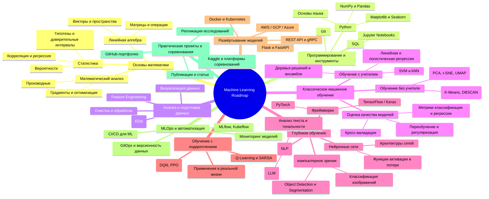
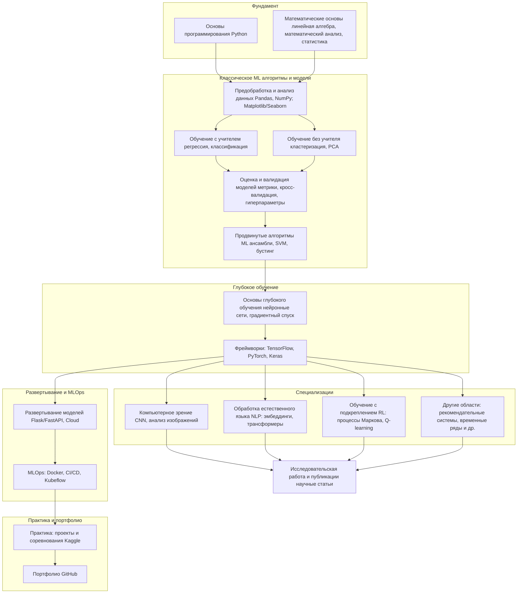

# Roadmap-ML

```mermaid
mindmap
  root((Machine Learning Roadmap))
    Основы математики
      Линейная алгебра
        Матрицы и операции
        Векторы и пространства
      Статистика
        Вероятности
        Гипотезы и доверительные интервалы
        Корреляция и регрессия
      Математический анализ
        Производные
        Градиенты и оптимизация
    Программирование и инструменты
      Python
        Основы языка
        NumPy и Pandas
        Matplotlib и Seaborn
      SQL
      Git
      Jupyter Notebooks
    Анализ и подготовка данных
      Очистка и обработка
      Исследовательский анализ (EDA)
      Feature Engineering
      Визуализация данных
    Классическое машинное обучение
      Обучение с учителем
        Линейная и логистическая регрессия
        Деревья решений и ансамбли
        SVM и kNN
      Обучение без учителя
        Кластеризация (K-Means, DBSCAN)
        Снижение размерности (PCA, t-SNE, UMAP)
      Оценка качества моделей
        Метрики классификации и регрессии
        Кросс-валидация
        Переобучение и регуляризация
    Глубокое обучение
      Нейронные сети
        Архитектуры сетей
        Функции активации и потери
      CNN (компьютерное зрение)
        Классификация изображений
        Object Detection и Segmentation
      RNN и Transformers (NLP)
        Анализ текста и тональности
        Генерация и языковые модели (LLM)
      Фреймворки
        TensorFlow / Keras
        PyTorch
    Обучение с подкреплением
      Q-Learning и SARSA
      Deep RL (DQN, PPO)
      Применения в реальной жизни
    Развёртывание моделей
      Flask и FastAPI
      Docker и Kubernetes
      AWS / GCP / Azure
      REST API и gRPC
    MLOps и автоматизация
      Мониторинг моделей
      CI/CD для ML
      MLflow, Kubeflow
      GitOps и версионность данных
    Практические проекты и соревнования
      Kaggle и платформы соревнований
      GitHub-портфолио
      Публикации и статьи
      Репликация исследований
```

```mermaid
graph TD
    subgraph "Фундамент"
        direction LR
        A1[Основы программирования Python]
        A2[Математические основы линейная алгебра, математический анализ, статистика]
    end
    subgraph "Классическое ML алгоритмы и модели"
        B1[Предобработка и анализ данных Pandas, NumPy; Matplotlib/Seaborn]
        B2[Обучение с учителем регрессия, классификация]
        B3[Обучение без учителя кластеризация, PCA]
        B4[Оценка и валидация моделей метрики, кросс-валидация, гиперпараметры]
        C1[Продвинутые алгоритмы ML ансамбли, SVM, бустинг]
        B1 --> B2
        B1 --> B3
        B2 --> B4
        B3 --> B4
        B4 --> C1
    end
    A1 --> B1
    A2 --> B1
    C1 --> C2
    subgraph "Глубокое обучение"
        C2[Основы глубокого обучения нейронные сети, градиентный спуск] --> C3[Фреймворки: TensorFlow, PyTorch, Keras]
    end
    C3 --> D1
    C3 --> D2
    C3 --> D3
    C3 --> D4
    subgraph "Специализации"
        D1[Компьютерное зрение CNN, анализ изображений]
        D2[Обработка естественного языка NLP: эмбеддинги, трансформеры]
        D3[Обучение с подкреплением RL: процессы Маркова, Q-learning]
        D4[Другие области: рекомендательные системы, временные ряды и др.]
    end
    R[Исследовательская работа и публикации научные статьи]
    D1 --> R
    D2 --> R
    D3 --> R
    D4 --> R
    subgraph "Развертывание и MLOps"
        E1[Развертывание моделей Flask/FastAPI, Cloud] --> E2[MLOps: Docker, CI/CD, Kubeflow]
    end
    C3 --> E1
    E2 --> P
    subgraph "Практика и портфолио"
        P[Практика: проекты и соревнования Kaggle] --> Q[Портфолио GitHub]
    end
```
