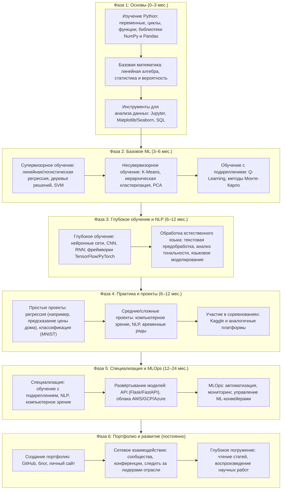

# Roadmap-ML

```mermaid
graph TD
  %% Фаза 1 – основы
  subgraph Phase1["Фаза 1: Основы (0–3 мес.)"]
    A1["Изучение Python: переменные, циклы, функции; библиотеки NumPy и Pandas"]
    A2["Базовая математика: линейная алгебра, статистика и вероятность"]
    A3["Инструменты для анализа данных: Jupyter, Matplotlib/Seaborn, SQL"]
    A1 --> A2 --> A3
  end

  %% Фаза 2 – базовое ML
  subgraph Phase2["Фаза 2: Базовое ML (3–6 мес.)"]
    B1["Супервизорное обучение: линейная/логистическая регрессия, деревья решений, SVM"]
    B2["Несувервизорное обучение: K-Means, иерархическая кластеризация, PCA"]
    B3["Обучение с подкреплением: Q-Learning, методы Монте-Карло"]
    B1 --> B2 --> B3
  end
  A3 --> Phase2

  %% Фаза 3 – глубокое обучение и NLP
  subgraph Phase3["Фаза 3: Глубокое обучение и NLP (6–12 мес.)"]
    C1["Глубокое обучение: нейронные сети, CNN, RNN; фреймворки TensorFlow/PyTorch"]
    C2["Обработка естественного языка: текстовая предобработка, анализ тональности, языковое моделирование"]
    C1 --> C2
  end
  Phase2 --> Phase3

  %% Фаза 4 – проекты
  subgraph Phase4["Фаза 4: Практика и проекты (6–12 мес.)"]
    D1["Простые проекты: регрессия (например, предсказание цены дома), классификация (MNIST)"]
    D2["Средние/сложные проекты: компьютерное зрение, NLP, временные ряды"]
    D3["Участие в соревнованиях: Kaggle и аналогичные платформы"]
    D1 --> D2 --> D3
  end
  Phase3 --> Phase4

  %% Фаза 5 – специализация и MLOps
  subgraph Phase5["Фаза 5: Специализация и MLOps (12–24 мес.)"]
    E1["Специализация: обучение с подкреплением, NLP, компьютерное зрение"]
    E2["Развёртывание моделей: API (Flask/FastAPI), облака AWS/GCP/Azure"]
    E3["MLOps: автоматизация, мониторинг, управление ML-конвейерами"]
    E1 --> E2 --> E3
  end
  Phase4 --> Phase5

  %% Фаза 6 – портфолио и непрерывное развитие
  subgraph Phase6["Фаза 6: Портфолио и развитие (постоянно)"]
    F1["Создание портфолио: GitHub, блог, личный сайт"]
    F2["Сетевое взаимодействие: сообщества, конференции, следить за лидерами отрасли"]
    F3["Глубокое погружение: чтение статей, воспроизведение научных работ"]
    F1 --> F2 --> F3
  end
  Phase5 --> Phase6
```
