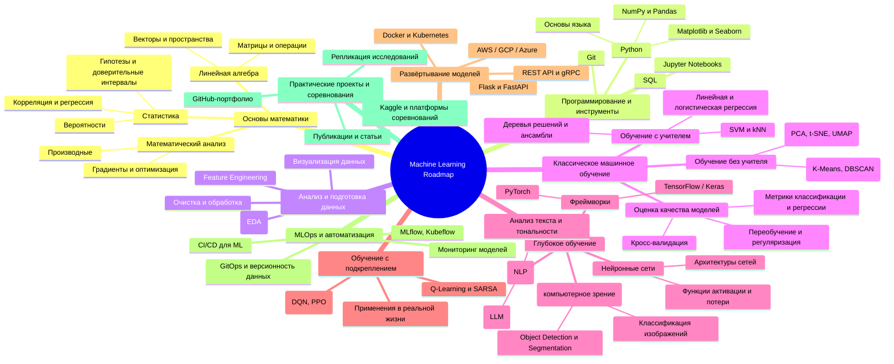

# Roadmap-ML

```mermaid
mindmap
  root((Machine Learning Roadmap))
    Основы математики
      Линейная алгебра
        Матрицы и операции
        Векторы и пространства
      Статистика
        Вероятности
        Гипотезы и доверительные интервалы
        Корреляция и регрессия
      Математический анализ
        Производные
        Градиенты и оптимизация
    Программирование и инструменты
      Python
        Основы языка
        NumPy и Pandas
        Matplotlib и Seaborn
      SQL
      Git
      Jupyter Notebooks
    Анализ и подготовка данных
      Очистка и обработка
      Исследовательский анализ (EDA)
      Feature Engineering
      Визуализация данных
    Классическое машинное обучение
      Обучение с учителем
        Линейная и логистическая регрессия
        Деревья решений и ансамбли
        SVM и kNN
      Обучение без учителя
        Кластеризация (K-Means, DBSCAN)
        Снижение размерности (PCA, t-SNE, UMAP)
      Оценка качества моделей
        Метрики классификации и регрессии
        Кросс-валидация
        Переобучение и регуляризация
    Глубокое обучение
      Нейронные сети
        Архитектуры сетей
        Функции активации и потери
      CNN (компьютерное зрение)
        Классификация изображений
        Object Detection и Segmentation
      RNN и Transformers (NLP)
        Анализ текста и тональности
        Генерация и языковые модели (LLM)
      Фреймворки
        TensorFlow / Keras
        PyTorch
    Обучение с подкреплением
      Q-Learning и SARSA
      Deep RL (DQN, PPO)
      Применения в реальной жизни
    Развёртывание моделей
      Flask и FastAPI
      Docker и Kubernetes
      AWS / GCP / Azure
      REST API и gRPC
    MLOps и автоматизация
      Мониторинг моделей
      CI/CD для ML
      MLflow, Kubeflow
      GitOps и версионность данных
    Практические проекты и соревнования
      Kaggle и платформы соревнований
      GitHub-портфолио
      Публикации и статьи
      Репликация исследований
```
