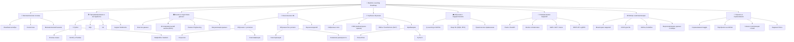

# Roadmap-ML

```mermaid
graph TB
    ML_Roadmap["🧠 Machine Learning Roadmap"]

    %% Основные разделы
    ML_Roadmap --> Math["📐 Математические основы"]
    ML_Roadmap --> Tools["🛠️ Программирование и инструменты"]
    ML_Roadmap --> Data["📊 Анализ и подготовка данных"]
    ML_Roadmap --> ClassicML["📖 Классическое ML"]
    ML_Roadmap --> DL["🧬 Глубокое обучение"]
    ML_Roadmap --> RL["🎮 Обучение с подкреплением"]
    ML_Roadmap --> Deploy["🚀 Развёртывание моделей"]
    ML_Roadmap --> MLOps["⚙️ MLOps и автоматизация"]
    ML_Roadmap --> Projects["📂 Проекты и соревнования"]

    %% Математика
    Math --> Algebra["Линейная алгебра"]
    Math --> Statistics["Статистика"]
    Math --> Calculus["Математический анализ"]

    %% Программирование и инструменты
    Tools --> Python["🐍 Python"]
    Tools --> SQL
    Tools --> Git
    Tools --> Jupyter["Jupyter Notebooks"]

    Python --> PythonBase["Основы языка"]
    Python --> NumPy["NumPy и Pandas"]
    Python --> Visualization["Matplotlib и Seaborn"]

    %% Анализ и подготовка данных
    Data --> Cleaning["Очистка данных"]
    Data --> EDA["Исследовательский анализ (EDA)"]
    Data --> FeatureEng["Feature Engineering"]
    Data --> DataViz["Визуализация данных"]

    %% Классическое ML
    ClassicML --> Supervised["Обучение с учителем"]
    ClassicML --> Unsupervised["Обучение без учителя"]
    ClassicML --> Eval["Оценка моделей"]

    Supervised --> Regression["Регрессия"]
    Supervised --> Classification["Классификация"]

    Unsupervised --> Clustering["Кластеризация"]
    Unsupervised --> DimReduction["Снижение размерности"]

    %% Глубокое обучение
    DL --> NN["Нейронные сети"]
    DL --> CNN["CNN (компьютерное зрение)"]
    DL --> NLP["RNN и Transformers (NLP)"]
    DL --> Frameworks["Фреймворки"]

    Frameworks --> TF["TensorFlow"]
    Frameworks --> PT["PyTorch"]

    %% Обучение с подкреплением
    RL --> RLBasic["Q-Learning и SARSA"]
    RL --> RLDeep["Deep RL (DQN, PPO)"]
    RL --> RLReal["Практическое применение"]

    %% Развёртывание моделей
    Deploy --> WebAPI["Flask и FastAPI"]
    Deploy --> Containers["Docker и Kubernetes"]
    Deploy --> Cloud["AWS / GCP / Azure"]
    Deploy --> API["REST API и gRPC"]

    %% MLOps и автоматизация
    MLOps --> Monitoring["Мониторинг моделей"]
    MLOps --> CICD["CI/CD для ML"]
    MLOps --> MLFlow["MLflow, Kubeflow"]
    MLOps --> Versioning["Версионирование данных и GitOps"]

    %% Проекты и соревнования
    Projects --> Kaggle["Соревнования Kaggle"]
    Projects --> Portfolio["Портфолио на GitHub"]
    Projects --> Papers["Чтение и репликация статей"]
    Projects --> Blog["Ведение блога"]
```
